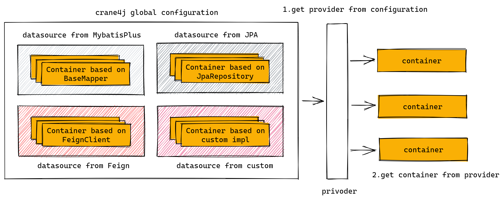

## 9.0 概述

容器提供者 `ContainerProvider` 是用于隔离数据源，并且对数据源获取途径进行增强的组件，它可以简单的理解为数据源容器的容器，比如 `Crane4j` 的全局配置类 `Crane4jGlobalConfiguration` 本身就是一个 `ContainerProvider`。

当解析器解析配置得到用户指定的 `namespace` 时，会：

- 先从全局配置类/上下文找到指定的 `ContainerProvider`；
- 若有必要，`ContainerProvider` 先对 `namespace` 进行解析（比如表达式或者方法调用）；
- `ContainerProvider` 使用解析后的 `namespace` 寻找已注册的容器；

不同的数据源将会根据其所属的 `ContainerProvider` 彼此隔离，第三方的框架接入时只需提供自己的 `ContainerProvider` 即可，不必担心影响其他的数据源。比如，项目中可能有多个数据源，这种情况下同样用于提供用户信息的容器 `userContainer` ，可能就需要同时存在两个，并且指向不同的数据源，此时即可根据 `ContainerProvider` 进行区分。
